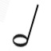

# Musical Symbols Machine Learning
Machine learning project to identify hand-written musical symbols.

## Introduction:
This is a study of Neural Networks and Deep Learning.  A Neural Network is a super powerful universal classifier.  As per the assignment, the recipe for the approach is
- properly scale, normalized, and encode your inputs (features) and outputs (labels)
- assign each column in the input array (X) to an input of the neural network
- define at least one hidden layer and optional additional hidden layers
- define one output node for each category to be detected
- user a ReLU activation function on your hidden layers and a Softmax activation function on the outputs
- tweak as desired or as necessary

Following the MNIST studies on hand-written digits completed in class, we found a dataset of handwritten musical notes:  Whole note, half note, quarter note, eighth note, and sixteenth note.  

The 5,000 images were split into a training set and a testing set.   
We built a neural network using the Sequential model from sklearn. We then trained our model using each of the optimizers, gathering the loss and accuracy data from fitting the model each time.
Each model was then tested again the test data, and the results were gathered.
Finally, as a last step, various musical notes were handdrawn by the team and fed into the model.

## Overview
This study builds a neural network, holds the topology constant with the same number of layers and nodes, and experiments with 8 different optimizers. They are studied for loss and for accuracy.    

1. Data wrangling
The original data is found [here](https://www.kaggle.com/kishanj/music-notes-datasets) on  Kaggle.  The initial zip file extract put the files in several levels of  subfolders for each note type. To simplify the code, all files were copied out of their subdirectories into single "Images" folder. Images folder was added to .gitignore because the size of the data exceeded git limits.
1. 
